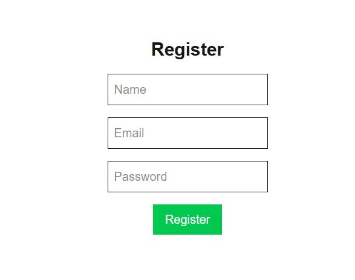
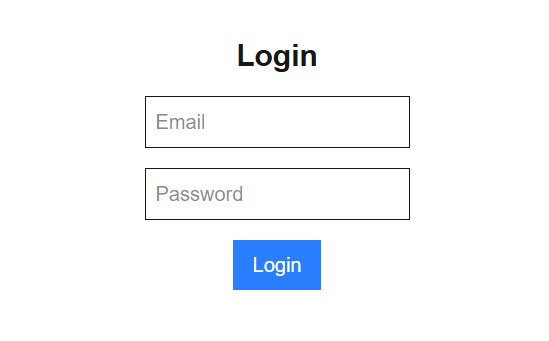
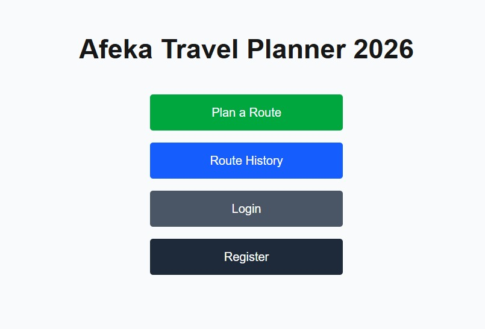
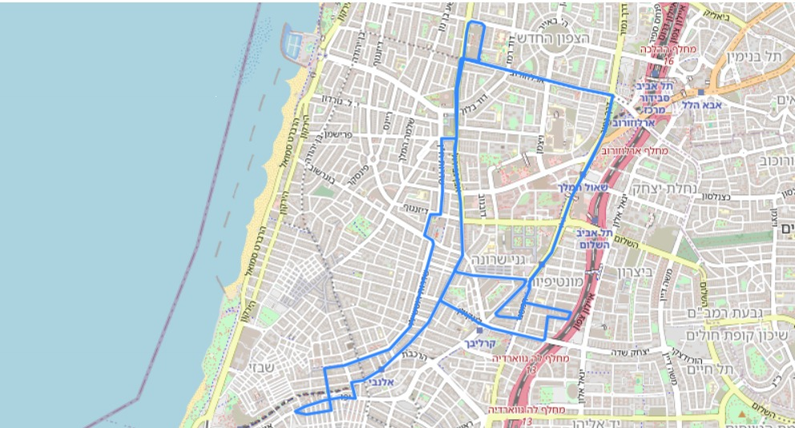
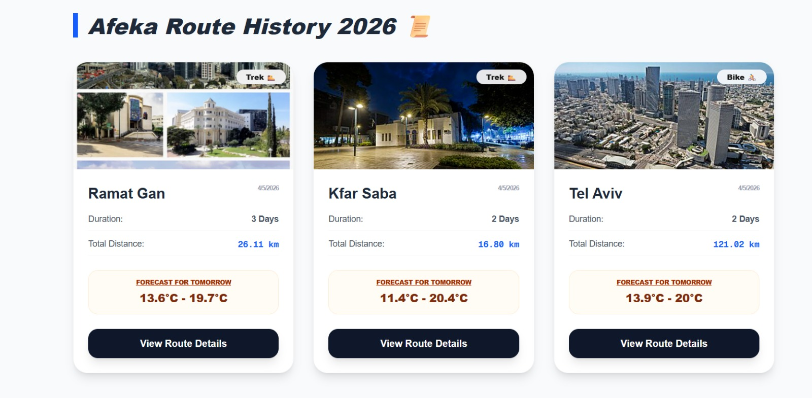

<div align="center">

# 🌍 Afeka Travel Planner 2026

### Smart Travel Planning with AI

<br/>


</div>

---

## 👥 Authors

- *Rotem Gilboa*
- *Maayan Shani*

---

## 🧠 About The Project

*Afeka Travel Planner 2026* is a full-stack web application that helps users plan smart travel routes with AI assistance.

The system generates routes, suggests attractions, shows weather forecasts, and keeps a full history of trips.

---

## 🎥 Project Demo Video

Watch a full demonstration of the *Afeka Travel Planner 2026* in action on YouTube:

<div align="center">
  <a href="https://www.youtube.com/watch?v=fQ_-UT3h9ZI">
    
  </a>
</div>

---

## 📽️ Project Presentation

Check out our full project presentation for a deep dive into the system's design and features:

<div align="center">
  <a href="Afeka-Travel-Planner-2026.pdf">
    
  </a>
</div>

---

## ✨ Features

### 🚴 Smart Route Generation


- Cycling routes (30–70 km/day)
- Trekking loop routes (5–10 km/day)
- Real roads using OSRM

---

### 🗺 Interactive Map & History


- Save full routes to database
- Re-display routes on map
- Update weather dynamically

---

### 🤖 AI Travel Assistant

- Restaurant & attraction suggestions
- Location-based recommendations
- Powered by Llama AI

---

## 🏗 Architecture

### Backend (Express)

- Authentication with JWT
- Password hashing (bcrypt)
- AI API integration
- MongoDB storage

### Frontend (Next.js)

- Protected routes
- Interactive maps (Leaflet)
- Dynamic UI with React

---

## 📸 Screenshots

<div align="center">
  <h3>🔐 Authentication</h3>
  <kbd></kbd>
  &nbsp;&nbsp;&nbsp;
  <kbd></kbd>

  <br><br>

  <h3>🏠 Dashboard & Planning</h3>
  <kbd></kbd>
  &nbsp;&nbsp;&nbsp;
  <kbd></kbd>

  <br><br>

  <h3>🗺️ Routes & History</h3>
  <kbd></kbd>
  &nbsp;&nbsp;&nbsp;
  <kbd></kbd>
  &nbsp;&nbsp;&nbsp;
  <kbd></kbd>
</div>

---

## ⚙️ Installation

### Backend

```bash
cd server
npm install
````

`.env`

```env
MONGO_URI=your_uri
JWT_ACCESS_SECRET=your_secret
JWT_REFRESH_SECRET=your_secret
GROQ_API_KEY=your_key
```

Run:

```bash
node index.js
```

-----

### Frontend

```bash
cd client
npm install
```

`.env.local`

```env
NEXT_PUBLIC_API_URL=http://localhost:4000
```

Run:

```bash
npm run dev
```

-----

## 🚀 Deployment

  - MongoDB Atlas ☁️
  - Runs locally + cloud DB

-----

<div align="center"\>

### ⭐ If you like this project – give it a star ⭐
